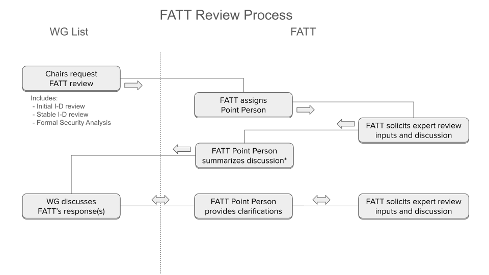
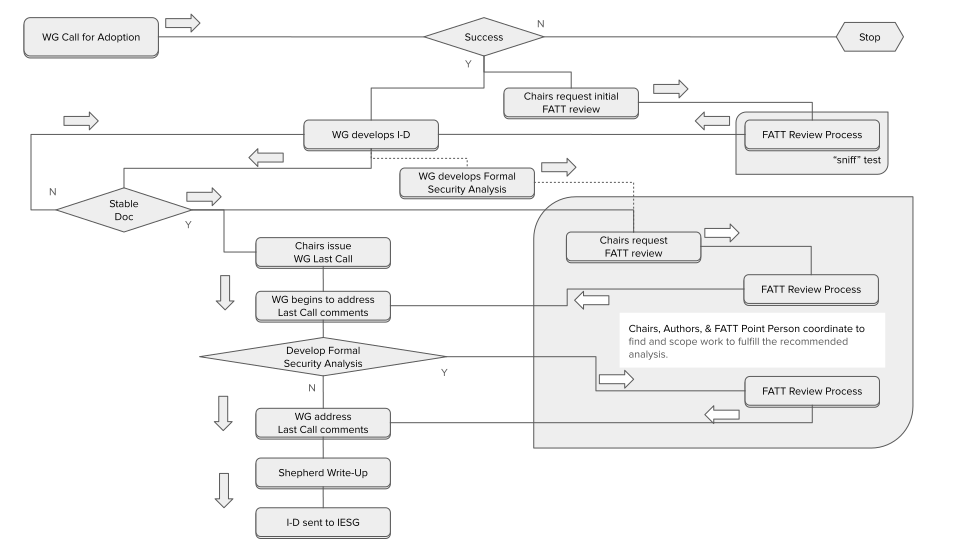

x# tls-fatt
Information about TLS WG formal analysis triage group

# FATT Process Overview

_The FATT process is under discussion and development. This overview draws
from the [initial FATT
announcement](https://mailarchive.ietf.org/arch/msg/tls/FhhICSR3qlLHjFcf1cA7Iry11CA/),
[TLS Interim on
FATT](https://datatracker.ietf.org/meeting/interim-2024-tls-02/session/tls),
and [A "permanent" Design Group for
TLS](https://richsalz.github.io/draft-rsalz-tls-analysis/draft-rsalz-tls-analysis.html)_

The goal of the FATT process is to maintain the high degree of cryptographic
assurance in TLS 1.3 as it evolves as a living cryptographic protocol. This
includes ensuring that existing security properties are maintained and new
claimed properties are met and understood. The formal analysis triage process
centers around the formal analysis triage panel made up of a group of experts
in the field of security protocol formal analysis. This panel is consulted to
provide input about the need for and the review of formal analysis into the
working group process. Recommendations output from the FATT for a particular
document may range from 'nothing required' to 'pen-and-paper proof can be
updated' to 'a formal methods model using a specific tool ought to be done' -
the 'formal' is not limited to formal methods but to formal security modeling
generally. This process is outlined below.

## The FATT Panel and FATT Point Person

The FATT panel is similar to a design team as defined in [Section 6.5 in RFC
2418](https://www.rfc-editor.org/rfc/rfc2418#section-6.5). As with a design
team the output of the FATT Panel is subject to approval, rejection or
modification by the WG as a whole. The FATT panel is a long-lived group that
handles security protocol analysis for many TLS working group documents.

The membership of the FATT is chosen and managed by the working group chairs
in consultation with the working group. The current [membership of the
FATT](fatt-membership.md) will be maintained in this repository. Anyone
wishing to join or nominate someone for the FATT should contact the chairs by
emailing "tls-chairs@ietf.org". Any member of the FATT may terminate their
participation at any time by emailing "tls-chairs@ietf.org". The chairs
inform the working group of changes to the FATT membership and update this
repository. If a working group member has concerns about the FATT membership
they may contact the working group chairs or the responsible Area Director.

The deliberations and discussions of the FATT are private while the output
consensus of the panel is public. A FATT point person is selected from the FATT
membership to interact with the working group and discuss the consensus of
the FATT for a particular document. The intention is that the FATT point person
for a document stays the same for the lifetime of the document in the working
group, but if a point person is not able to continue in this duty then a new
point person is assigned. The point person also helps to make clarification and answer
questions from the working group. The point people for particular working group
documents will be maintained in this repo (unless there is an appropriate
field for this in the data tracker). The communication between the FATT and
the working group is covered by the IETF note-well.

The diagram below provides an overview of the interaction between the working
group and the FATT and FATT point person.

## Integration with Working Group Process

Below is a summary diagram of the integration of the FATT into the working
group process.

### Document Adoption

When a document is adopted by the working group the chairs will make a
determination whether the change proposed by the document requires review by
the FATT to determine if formal protocol analysis is necessary for the
change. For example a proposal that modifies the TLS key schedule or the
authentication process would likely result in asking the FATT, whereas a
change such as modifying the SSLKEYLOG format would not. The working group
chairs will inform the working group of this decision.

If FATT triage is deemed necessary then the working chairs will contact the
FATT and request a point person be assigned to the document. This request may be
sent anywhere from when the document is adopted to 2 months after the
adoption depending upon the current load of the FATT. The request to the FATT
will include a link to the document and time frame in which the output of the
FATT is requested. This time frame will typically be 1 month. The FATT will
be requested to provide an assessment of whether the document needs
additional formal analysis to validate its security properties, of what
kind/character, regarding which established or newly claimed security
properties, and general estimates of the scope of work such recommendations
would take to complete.

The output of the FATT is posted to the working group by the FATT
point person. The output may say that additional analysis is not warranted or it
may indicate what type of analysis should be done. The FATT may also ask the
working group for clarification on what security properties are intended for
a particular change. The FATT may also provide suggestions as to what tools
can be used for the analysis or who may be able to help with the analysis.

The working group takes this output as input to the design and analysis of
the document. The working group may interact with the point person on the working
group mail list to ask for clarifications or more information. The working
group is not obligated to follow the FATT recommendation. The working group
does not need to wait on an initial FATT assessment in order to start work on
the document.

### Document Development

During the development of the document the document authors and working group
may try to address the comments made by the FATT. During development of the
document the working group can request input from the FATT through the
point person on the working group mailing list. The FATT and the chairs will help
the document authors and working group to find resources to assist in the
analysis process. The Usable Formal Methods Research Group (UFMRG) in the
IRTF may also be consulted to help with conducting formal analysis.

### Working Group Last Call (WGLC)

If some formal analysis has been done then the chairs will request that the
FATT point person for the document take the analysis that has been done for review
by the FATT during WGLC. This request will contain a link to the current
document, a link to the analysis, and WGLC time frame. The FATT will be
requested to provide an assessment of whether the document meets the claimed
security properties.

The assessment (if provided) will be provided along with the initial FATT
assessment as comments to the working group last call process. The working
group consensus process determines of the document is ready to progress to
the IESG.  The working group is under no obligation to follow the FATT
recommendations.  If the FATT fails to provide output within a reasonable
time frame as determined by the working group chairs the processing of the
document should continue as normal.

The document shepherd should include a summary of the FATT review in the
additional reviews section of the shepherd write-up (currently question 5)
along with any other relevant security analysis of the protocol changes,
whether resulting from FATT interaction or not.

# FATT Membership

[Current FATT Membership](fatt-membership.md)

# FATT process diagrams

## FATT review process

## FATT Integration with TLS WG Process

